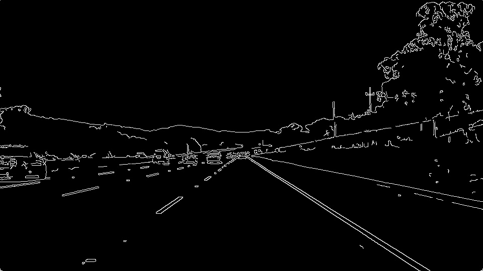
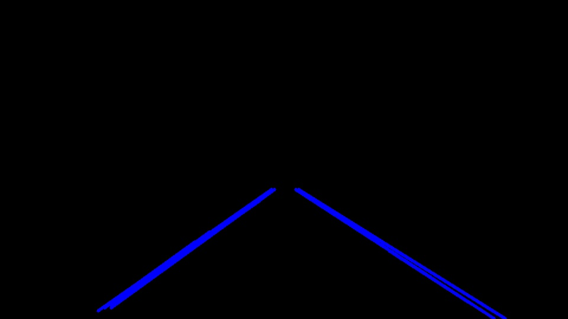

# **Finding Lane Lines on the Road** 

Overview
---

When we drive, we use our eyes to decide where to go. The lines on the road show us where the lanes act as our constant reference for where to steer the vehicle. Naturally, one of the first things we would like to do in developing a self-driving car is to automatically detect lane lines using an algorithm. 

This project aims to create a pipeline that finds lane lines on the road using Canny edge detection, image masking, and Hough transforms through OpenCV.

---
* Make a pipeline that finds lane lines on the road
* Reflect on your work in a written report

[//]: # (Image References)

[image1]: ./examples/grayscale.jpg "Grayscale"

---

### Reflection

### 1. Describe your pipeline. As part of the description, explain how you modified the draw_lines() function.

My pipeline consisted of 5 steps.

* Convert the images to grayscale.
* Apply Gaussian smoothing

### Step 1 Convert Grayscale image

Many computer vision and image processing algorithms (Canny, Hough, Sobel) use grayscale images instead of color images. To detect white or yellow lines in images, it is useful to create particularly high contrast in the image. Converting to grayscale helps us with this task in addition to reducing noise even more. This step is also part of the image preprocessing before running more powerful algorithms to isolate lines.

### Step 2 apply Gaussian smoothing

In this method, instead of a box filter, a Gaussian kernel is used. It is done with the function, cv.GaussianBlur(). We should specify the width and height of the kernel which should be positive and odd.   Gaussian blurring is highly effective in removing Gaussian noise from an image.

### Step 3 Canny Edge Detection

Canny edge detection is a technique to extract useful structural information from different vision objects and dramatically reduce the amount of data to be processed. It has been widely applied in various computer vision systems. Canny has found that the requirements for the application of edge detection on diverse vision systems are relatively similar. Thus, an edge detection solution to address these requirements can be implemented in a wide range of situations.

### Step 4 Create a Masked Edges Image

Using an edge mask to focus images on. It is useful for sharpening the edges, particularly when details or used to define the region of interest are required formed by a polygon from vertices. The rest of the image is set to black.

### Step 5 Using the Hough Transform to Find Lines 

The Hough transform is a feature extraction technique used in image analysis, computer vision, and digital image processing. The technique's purpose is to find imperfect instances of objects within a certain class of shapes by a voting procedure. This voting procedure is carried out in parameter space. Object candidates are obtained as local maxima in a so-called accumulator space explicitly constructed by the algorithm for computing the Hough transform.

### Draw Lines

In order to draw a single line on the left and right lanes, I modified the draw_lines () function by find_lines () to change the size of the ROI mask to limit the lane capture area, which could filter out more noise.
Then, increase the threshold of the minimum number of votes, the model could identify the lane more precisely, as learned in the Hough Transformation. The large intersection number in a Hough Space refers to a possible line in the Space image. It could help to reduce the interference in the area of the vertices.

Parameter Settings.

For the Canny high_treshold function, it was tuned up a bit to help better filter the white lane of the image. values> 100 were used

The min_line_length values were also adjusted much larger to avoid capturing extremely short lines or points.

A larger max_line_gap setting prevents lane segmenting.

---

### Test Video

[Finding Lane Lines Solid White Right Lines](https://youtu.be/Cn-RkulyO4E)

[Finding Lane Lines Solid Yellow Left Lines](https://youtu.be/Xzt9AzoNvgw)

### 2. Identify potential shortcomings with your current pipeline

A potential deficiency would be when the road is under repair, and there are no road lines.

Another deficiency could be identifying the lines if the road is in poor condition with cracks or there are on the road.

### 3. Suggest possible improvements to your pipeline

A possible improvement would be to apply Machine Learning to use some prediction to guess where the lines should be based on the previous frames until lines are detected again.

Another potential improvement could be when an algorithm that detects the lane lines within the region of interest could be extended in the polygon, in this way; it could improve the detection in case of eventualities such as a car that invades the lane or the road in poor condition.